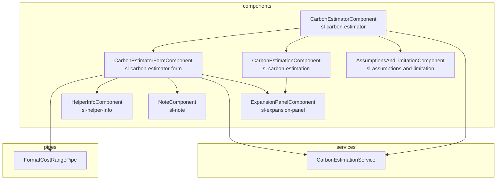

# Components

This page details the Angular components that are part of the application and how they relate to each other.

## CarbonEstimatorComponent

Chooses which of its sub-components to display based on the current state.  
Receives events from sub components to transition between states.  
Uses the [CarbonEstimationService](services#carbonestimationservice) to produce the estimation for display.

## CarbonEstimatorFormComponent

The main form for user input, takes care of validation and updates descriptions in response to input changes.  
Uses the [CarbonEstimationService](services#carbonestimationservice) to estimate the number of servers.  
Uses the [FormatCostRangePipe](pipes#formatcostrangepipe) to display the monthly cloud bill options.

## CarbonEstimationComponent

Visualises the Carbon Estimation result.

## AssumptionsAndLimitationComponent

Provides information on the Assumptions and Limitations of the estimation.

## HelperInfoComponent

Displays a help button which can be clicked to show extra details on how the form inputs are used.

## NoteComponent

Highlights assumptions that will be made when certain options are selected.

## ExpansionPanelComponent

Displays explanatory text that can be hidden if desired.
