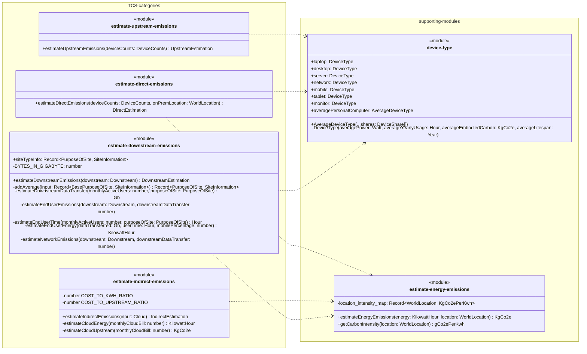
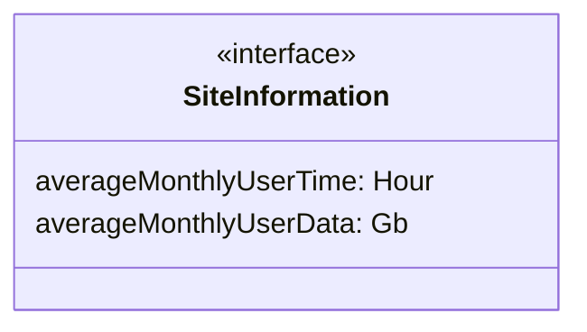
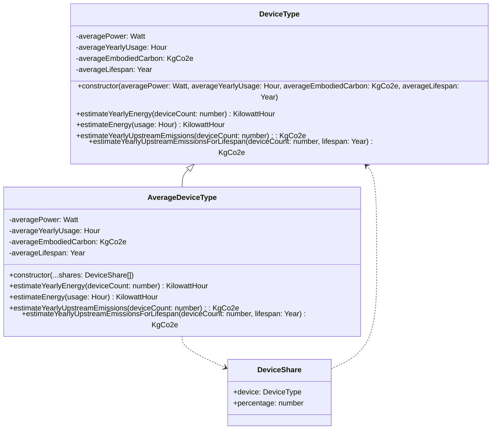

# Estimation

The estimation folder contains modules and classes related to the estimation process.

## estimate-upstream-emissions

### Exported functions

#### `estimateUpstreamEmissions()`

Estimate emissions from Upstream categories

##### Parameters

`deviceCounts: DeviceCounts` - The Device counts to estimate upstream emissions for.

##### Returns

`UpstreamEstimation` - Estimation of Upstream emissions under TCS categories.

## estimate-direct-emissions

### Exported functions

#### `estimateDirectEmissions()`

Estimate emissions from Direct categories

##### Parameters

`deviceCounts: DeviceCounts` - The Device counts to estimate upstream emissions for.
`onPremLocation: WorldLocation` - The World Location of the hardware for Carbon Intensity.

##### Returns

`DirectEstimation` - Estimation of Direct emissions under TCS categories.

## estimate-indirect-emissions

### Exported functions

#### `estimateIndirectEmissions()`

Estimate emissions from Indirect categories

##### Parameters

`input: Cloud` - The inputs relevant to cloud.

##### Returns

`IndirectEstimation` - Estimation of Indirect emissions under TCS categories.

## estimate-downstream-emissions

### Exported variables

#### `siteTypeInfo: Record<PurposeOfSite, SiteInformation>`

Exported to allow use in assumptions component.

---

### Exported functions

#### `estimateDownstreamEmissions()`

Estimate emissions from Downstream categories

##### Parameters

`downstream: Downstream` - The inputs relevant to downstream emissions.

##### Returns

`DownstreamEstimation` - Estimation of Downstream emissions under TCS categories.

## device-type

The `DeviceType` class is not exported but performs calculations based on average power, usage, embodied carbon, and lifespan.

### Exported variables

#### `laptop: DeviceType`
#### `desktop: DeviceType`
#### `server: DeviceType`
#### `network: DeviceType`
#### `mobile: DeviceType`
#### `tablet: DeviceType`
#### `monitor: DeviceType`
#### `averagePersonalComputer: AverageDeviceType`

Exported to allow use in various calculations.

---

### Exported classes

#### `AverageDeviceType`

Exported to allow an average device to be created based on mobile end-user ratio.

## estimate-energy-emissions

### Exported functions

#### `estimateEnergyEmissions()`

Estimate emissions from energy used in a location.

##### Parameters

`energy: KilowattHour` - Amount of energy used.
`location: WorldLocation` - The World Location where the energy was used for Carbon Intensity.

##### Returns

`KgCo2e` - Kg of CO2e emitted via energy use.

---

#### `getCarbonIntensity()`

Exported to get Carbon Intensity in unit that [CO2.js](https://www.thegreenwebfoundation.org/co2-js/) library requires.

##### Parameters

`location: WorldLocation` - The World Location for Carbon Intensity.

##### Returns

`gCo2ePerKwh` - g of CO2e emitted per kWh of energy used.
