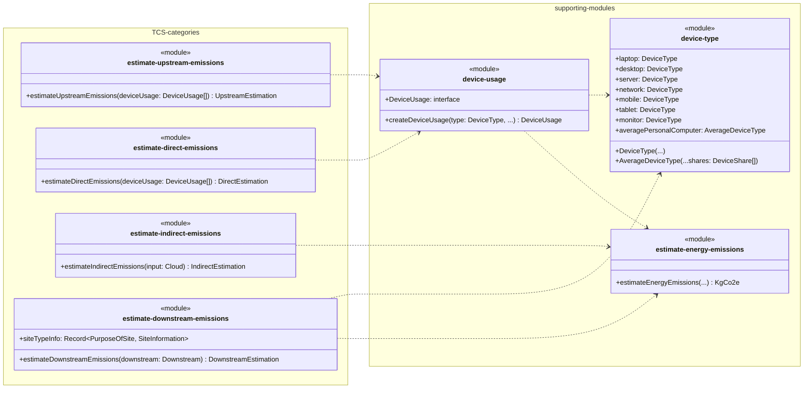
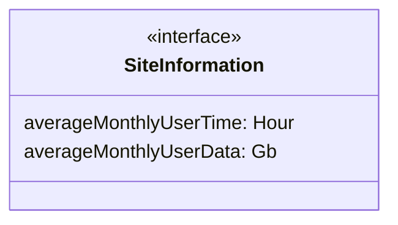
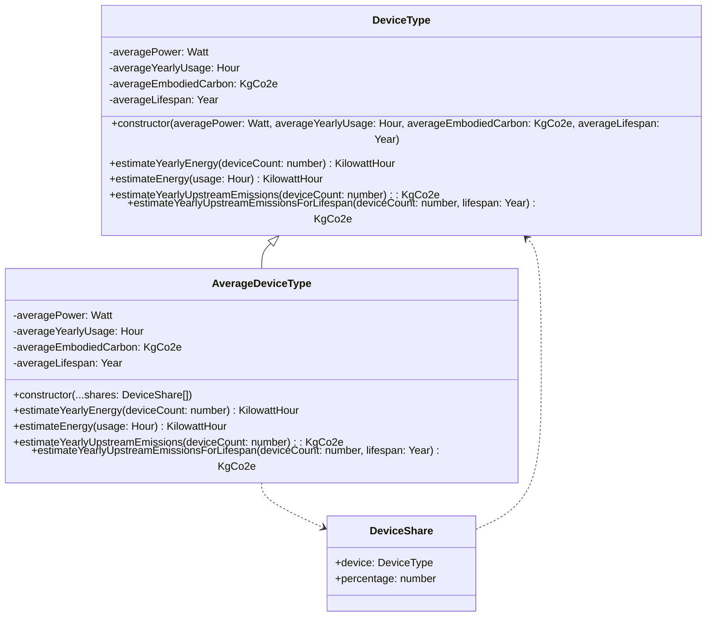
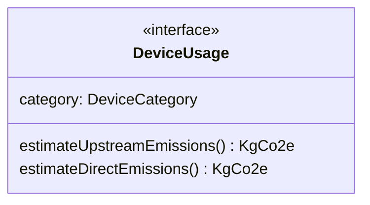

# Estimation

The estimation folder contains modules and classes related to the estimation process.

## estimate-upstream-emissions

### Exported functions

#### `estimateUpstreamEmissions()`

Estimate emissions from Upstream categories

##### Parameters

`deviceUsage:`[`DeviceUsage`](#deviceusage)`[]` - The Device usage to estimate upstream emissions for.

##### Returns

[`UpstreamEstimation`](types.md#carbonestimation) - Estimation of Upstream emissions under TCS categories.

## estimate-direct-emissions

### Exported functions

#### `estimateDirectEmissions()`

Estimate emissions from Direct categories

##### Parameters

`deviceUsage:`[`DeviceUsage`](#deviceusage)`[]` - The Device usage to estimate direct emissions for.  

##### Returns

[`DirectEstimation`](types.md#carbonestimation) - Estimation of Direct emissions under TCS categories.

## estimate-indirect-emissions

### Exported functions

#### `estimateIndirectEmissions()`

Estimate emissions from Indirect categories

##### Parameters

`input:`[`Cloud`](types.md#estimatorvalues) - The inputs relevant to cloud.

##### Returns

[`IndirectEstimation`](types.md#carbonestimation) - Estimation of Indirect emissions under TCS categories.

## estimate-downstream-emissions

### Exported variables

#### `siteTypeInfo: Record<PurposeOfSite, SiteInformation>`

Exported to allow use in assumptions component.

### Exported functions

#### `estimateDownstreamEmissions()`

Estimate emissions from Downstream categories

##### Parameters

`downstream:`[`Downstream`](types.md#estimatorvalues) - The inputs relevant to downstream emissions.

##### Returns

[`DownstreamEstimation`](types.md#carbonestimation) - Estimation of Downstream emissions under TCS categories.

## device-type

### `DeviceType`

The `DeviceType` class performs calculations based on average power, usage, embodied carbon, and lifespan. This module also exports multiple types of devices with different averages.

#### Public Methods

##### `estimateYearlyEnergy()`

Estimates the energy a given amount of devices will use in a year.

###### Parameters

`deviceCount: number` - The number of devices.

###### Returns

[`KilowattHour`](types.md#units) - The estimated amount of energy used.

##### `estimateEnergy()`

Estimates the energy a device would use over a given amount of hours.

###### Parameters

`usage: Hour` - The amount of hours the device is used for.

###### Returns

[`KilowattHour`](types.md#units) - The estimated amount of energy used.

##### `estimateYearlyUpstreamEmissions()`

Estimates the yearly upstream emissions of a given number of devices.

###### Parameters

`deviceCount: number` - The number of devices.

###### Returns

[`KgCo2e`](types.md#units) - The estimated upstream emissions.

##### `estimateYearlyUpstreamEmissionsForLifespan()`

Estimates the yearly upstream emissions of a given number of devices with a specific lifespan.

###### Parameters

`deviceCount: number` - The number of devices.  
`lifespan:`[`Year`](types.md#units) - The desired lifespan of the device.

###### Returns

[`KgCo2e`](types.md#units) - The estimated upstream emissions.

### Exported variables

#### `laptop: DeviceType`
#### `desktop: DeviceType`
#### `server: DeviceType`
#### `network: DeviceType`
#### `mobile: DeviceType`
#### `tablet: DeviceType`
#### `monitor: DeviceType`
#### `averagePersonalComputer: AverageDeviceType`

Exported to allow use in various calculations.

### Exported classes

#### `DeviceType`

Exported so that [`DeviceUsage`](#deviceusage) can reference the type internally. This module also exports multiple types of devices with different averages.

#### `AverageDeviceType`

Exported to allow an average device to be created based on mobile end-user ratio.

## device-usage

### Exported interfaces

#### `DeviceUsage`

Exported to be used as parameter for upstream and direct estimation functions.

### Exported functions

#### `createDeviceUsage()`

Creates device usage without exposing the exact method of calculation.

##### Parameters

`type:`[`DeviceType`](#devicetype) - The type of device being used.  
`category:`[`DeviceCategory`](types#devicecategory) - The category the device usage falls under.  
`location:`[`WorldLocation`](types#estimatorvalues) - The location the devices are being used in.  
`count: number` - The number of devices being used.  
`pue?: number` - The Power Usage Effectiveness of the device usage (optional, defaults to 1).  

##### Returns

`DeviceUsage` - used to calculate the upstream and direct emissions of devices.

## estimate-energy-emissions

### Exported functions

#### `estimateEnergyEmissions()`

Estimate emissions from energy used in a location.

##### Parameters

`energy:`[`KilowattHour`](types.md#units) - Amount of energy used.  
`location:`[`WorldLocation`](types.md#estimatorvalues) - The World Location where the energy was used for Carbon Intensity.

##### Returns

[`KgCo2e`](types.md#units) - Kg of CO2e emitted via energy use.
