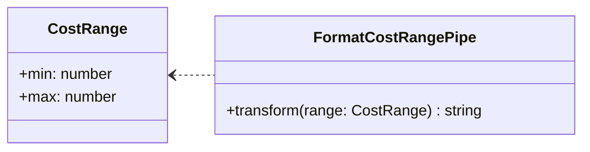

# Pipes

## FormatCostRangePipe

```mermaid
classDiagram
  direction LR
  class CostRange {
    +min: number
    +max: number
  }

  class FormatCostRangePipe {
    +transform(range: CostRange) string
  }

  CostRange <.. FormatCostRangePipe
```

Takes in a CostRange and outputs a string representation of it in dollars, with compact notation ie.  
`$500 - $1K`