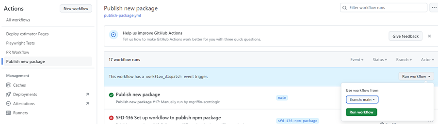
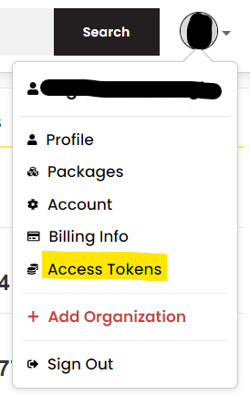
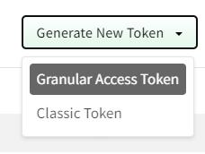
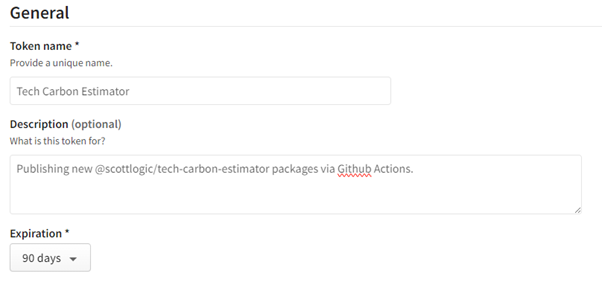
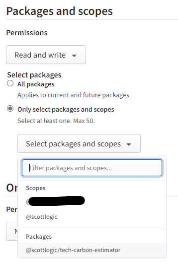
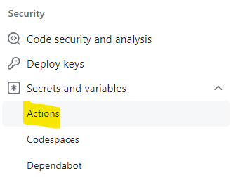
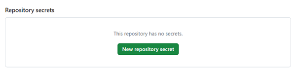
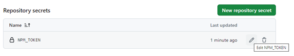

# Publishing Tech Carbon Estimator Package

## Introduction

We have created the Tech Carbon Estimator so that it can be used in multiple sites, by including its package from npm. This document outlines the publishing process, including details on version numbering.

## Creating a new release

The semantic-release configuration is currently set to only work sucessfully against `main` so it is important to follow these steps in prepartion for releasing and publishing a new version of the Tech Carbon Estimator.

1. Once the code on `develop` has been signed off for release, take a release cut by creating a branch off `develop` with the following naming convention `release/vX.X.X`. The semantic version you use in this branch name should follow the pattern below. 

  > - Fix release (contains `fix` commit messages) - increase the patch versaion
  > - Feature (contains  `feat` commit messages) - increase the minor version
  > - Breaking Change (contains `BREAKING CHANGE` commit message) - increase the major version

  To confirm this, you can run the `publish-dry-run` workflow on the release branch and check the output. If you have incorrectly named your release branch, recreate it with the right version.

2. The release branch should then be tested as per the release testing plan. Any issues that are discovered can be fixed directly on the release branch.
3. Once the release cut has passed the required qaulity gates, it can then be merged into `main`.
4. Publish the release by following the [Publishing via GitHub Action](#publishing-via-github-action) guide below

## Publish process

We rely on the [semantic-release](https://semantic-release.gitbook.io/semantic-release/) package to take care of determining version numbers and publishing the package to NPM/creating a GitHub release. This means that the version listed in the root `package.json` file is not used within the package process and is set to `0.0.0-semantically-released` for clarity. We also make use of a semantic-release plugin called [semantic-release-unsquash](https://github.com/romap0/semantic-release-unsquash) to ensure that squashed commits can still be analysed to determine the new version number.

To reduce the size of the published package and make it suitable for use in non-angular projects, we also build the components before packaging them. This is done via a `prepare` script, which builds using a specific `npm-package` configuration. This also copies the root README.md and package.json to the build directory, before removing unnecessary sections from the package. This must be done before running `npx semantic-release` to publish a new package, as it expects to find the package.json in the build directory and will fail early if it is not present.

This process can be run locally but you will need to create tokens for both NPM and GitHub, which must be stored in `NPM_TOKEN` and `GH_TOKEN` environment variables respectively.

## Publishing via GitHub Action

A workflow has been setup to publish new versions from GitHub, which does not require you have a Scott Logic member npm account. This will also create a GitHub release at the same time and update the GitHub pages site. Anyone with write access to the repo should be able to run the '[Publish new package](https://github.com/ScottLogic/sl-tech-carbon-estimator/actions/workflows/publish-package.yml)' workflow, which requires you to choose where to run it from.



Currently you can select to run this from any branch, although the semantic-release configuration will cause it to fail if it does not match up against the list of acceptable branches. For the moment this is only `main`.

Another error that can occur is the token used to allow GitHub Actions to publish to npm will expire. This would result in an error along the lines of:

```
npm error code E404

npm error 404 Not Found - PUT <https://registry.npmjs.org/@scottlogic%2ftech-carbon-estimator> - Not found

npm error 404

npm error 404 '@scottlogic/tech-carbon-estimator@0.0.2' is not in this registry.

npm error 404

npm error 404 Note that you can also install from a

npm error 404 tarball, folder, http url, or git url.
```

Since the request is not authorised, it acts as if the entry does not exist, instead of reporting that it does exist but you don't have access. To resolve this issue, see the next section.

## Troubleshooting

### Pipeline failure

The Publish new package workflow will currently fail on the last step of publishing to GitHub pages, due to duplicated steps in the pipeline attempting to create the same artifact twice. Issue [SFD-193](https://scottlogic.atlassian.net/browse/SFD-193) is logged to deal with this and until it is resolved, the 'Deploy estimator Pages' workflow should be triggered manually from the same tag.

### Updating NPM_TOKEN

NPM publishing has been setup using a secret token, which is only visible to those with admin access to the repo. If this ever expires and the original token creator is not available, then you will need to take the following steps to add a new one.

1. Gain admin access to the sl-tech-carbon-estimator repo.
2. Create an npm account and add it to the @scottlogic org.
3. Create a new token on npm.
4. Add it to the secrets within the github repo.

#### Gain admin access to the sl-tech-carbon-estimator repo

There should always be someone with admin access, which is managed by being a member of the <https://github.com/orgs/ScottLogic/teams/sustainable-technology-development-admin> team. If there are no active members in this team, you will need to make a Support Request.

#### Create an npm account and add it to the @scottlogic org

We have created the estimator package within the @scottlogic scope, which was possible due to there being a Scott Logic organization created on [npmjs.com](https://www.npmjs.com/org/scottlogic). To be able to publish packages to this organization from your local machine, you will need to be added as a member, which will require you to have an account set up there. It is not mandatory, but it is advised that your username matches that used for the GitHub account used for Scott Logic (a common pattern is &lt;initial&gt;&lt;surname&gt;-scottlogic).

To be added as a member, send a [Support Request](https://scottlogic.atlassian.net/servicedesk/customer/portal/1/group/67/create/66) asking to be added, along with your npm username. Be aware that this organization is not using a paid plan, so only public packages can be added under this scope. Attempts to use `npm publish` without adding the flag `--access public` will always fail.

#### Create a new token on npm

Initial instructions were written following [Github documentation](https://docs.github.com/en/actions/publishing-packages/publishing-nodejs-packages#publishing-packages-to-the-npm-registry) and current npmjs site, this may change in future.

Click on Access Tokens from your profile image on npmjs.com:



Click on ‘Generate New Token’ -> ‘Granular Access Token’



Add something like the following:





You should be able to select the specific package only, to minimise the access the token provides. The maximum selectable expiration is 90 days but a custom date can be selected if desired.

Once you submit this form, it should give you a token that can be copied. Make sure to take a copy of it at this point as it will never be shown in full again.

#### Add it to the secrets within the github repo

From <https://github.com/ScottLogic/sl-tech-carbon-estimator/settings>, access the secrets for actions:



Choose to add a new repository secret:



Name the token `NPM_TOKEN` and paste in the token you generated in the previous step. When updating this in future, it should already be present and only require the secret to be edited:


