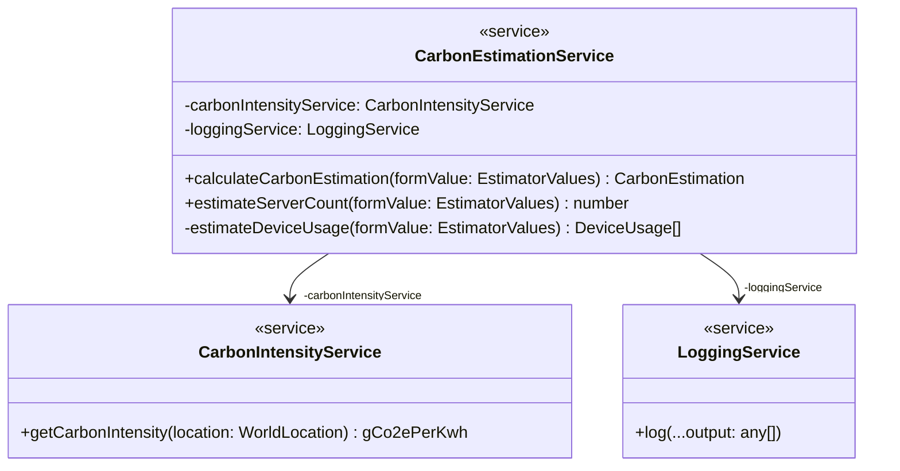
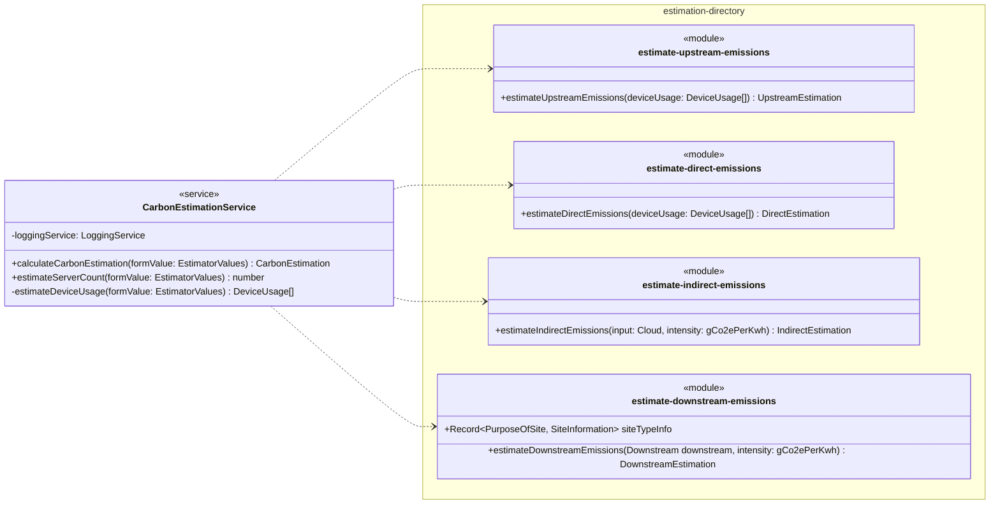

# Services

This page details the Angular services that are part of the application.

## CarbonEstimationService

The main service responsible for producing a carbon estimate.

### Public Methods

#### `calculateCarbonEstimation()`

Takes input form values and uses them to calculate a carbon estimation.  
Uses [LoggingService](#loggingservice) to output intermediate parts of the calculation.  
Uses [CarbonIntensityService](#carbonintensityservice) to get the carbon intensity of input locations.
Returns estimation as percentages.  
Uses functions in other modules to perform the calculation.

##### Parameters

`formValue:`[`EstimatorValues`](types.md#estimatorvalues) - The user form input.

##### Returns

[`CarbonEstimation`](types.md#carbonestimation) - Contains the components of the estimation as percentages.

#### `estimateServerCount()`

Method is used as part of [`calculateCarbonEstimation()`](#calculatecarbonestimation) and exposed publicly so that the [CarbonEstimatorFormComponent](components.md#carbonestimatorformcomponent) can update the preview server count as input values are changed.

##### Parameters

`formValue:`[`EstimatorValues`](types.md#estimatorvalues) - The user form input.

##### Returns

`number` - The estimated server count given the current input.

## CarbonIntensityService

Currently a simple service to wrap the usage of the CO2.js library to reduce dependencies and allow a switch to a different provider in future.

### Public Methods

#### `getCarbonIntensity()`

Gets a carbon intensity figure given a region.

##### Parameters

`location:`[`WorldLocation`](types.md#estimatorvalues) - The location to get the carbon intensity for.

##### Returns

[`gCo2ePerKwh`](types.md#units) - The carbon intensity of the location in grams of CO2 equivalent per Kilowatt hour of energy consumed.

## LoggingService

Currently a simple service to wrap console logging.

### Public Methods

#### `log()`

Checks whether `isDevMode()` returns true before calling `console.log()`. The method takes the same arguments as `console.log()` (a rest parameter array of `any`), so that it can be called in the same way and pass on the arguments directly.

##### Parameters

`...output: any[]` - Any data that should be logged.

##### Returns

`void`