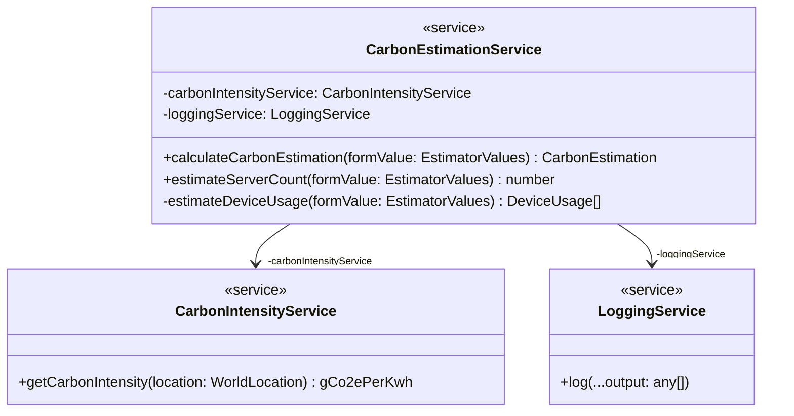
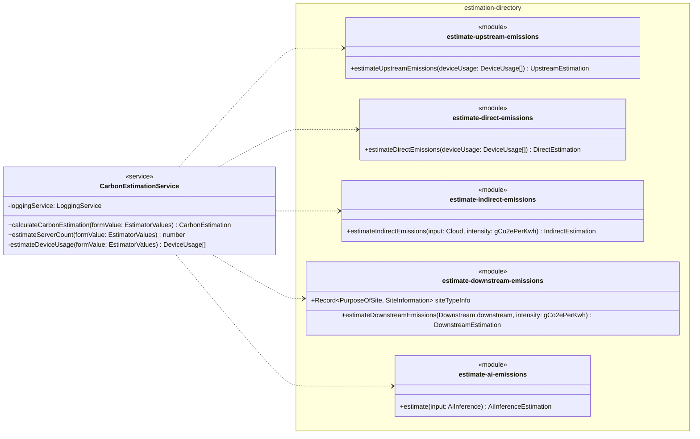

# Services

This page details the Angular services that are part of the application.

```mermaid
classDiagram
  class CarbonEstimationService{
    <<service>>
    -carbonIntensityService: CarbonIntensityService
    -loggingService: LoggingService
    +calculateCarbonEstimation(formValue: EstimatorValues) CarbonEstimation
    +estimateServerCount(formValue: EstimatorValues) number
    -estimateDeviceUsage(formValue: EstimatorValues) DeviceUsage[]
  }

  class CarbonIntensityService{
    <<service>>
    +getCarbonIntensity(location: WorldLocation) gCo2ePerKwh
  }

  class LoggingService{
    <<service>>
    +log(...output: any[])
  }

  CarbonEstimationService --> "-carbonIntensityService" CarbonIntensityService
  CarbonEstimationService --> "-loggingService" LoggingService
```

## CarbonEstimationService

The main service responsible for producing a carbon estimate.

### Public Methods

#### `calculateCarbonEstimation()`

Takes input form values and uses them to calculate a carbon estimation.  
Uses [LoggingService](#loggingservice) to output intermediate parts of the calculation.  
Uses [CarbonIntensityService](#carbonintensityservice) to get the carbon intensity of input locations.
Returns estimation as percentages.  
Uses functions in other modules to perform the calculation.

```mermaid
classDiagram
  direction LR
  class CarbonEstimationService{
    <<service>>
    -loggingService: LoggingService 
    +calculateCarbonEstimation(formValue: EstimatorValues) CarbonEstimation
    +estimateServerCount(formValue: EstimatorValues) number
    -estimateDeviceUsage(formValue: EstimatorValues) DeviceUsage[]
  }

  namespace estimation-directory {
    class estimate-upstream-emissions{
      <<module>>
      +estimateUpstreamEmissions(deviceUsage: DeviceUsage[]) UpstreamEstimation
    }

    class estimate-direct-emissions{
      <<module>>
      +estimateDirectEmissions(deviceUsage: DeviceUsage[]) DirectEstimation
    }

    class estimate-indirect-emissions{
      <<module>>
      +estimateIndirectEmissions(input: Cloud, intensity: gCo2ePerKwh) IndirectEstimation
    }

    class estimate-downstream-emissions{
      <<module>>
      +Record~PurposeOfSite, SiteInformation~ siteTypeInfo
      +estimateDownstreamEmissions(Downstream downstream, intensity: gCo2ePerKwh) DownstreamEstimation
    }

    class estimate-ai-emissions{
      <<module>>
      +estimate(input: AiInference) AiInferenceEstimation
    }
  }

  CarbonEstimationService ..> estimate-upstream-emissions
  CarbonEstimationService ..> estimate-direct-emissions
  CarbonEstimationService ..> estimate-indirect-emissions
  CarbonEstimationService ..> estimate-downstream-emissions
  CarbonEstimationService ..> estimate-ai-emissions
```

##### Parameters

`formValue:`[`EstimatorValues`](types.md#estimatorvalues) - The user form input.

##### Returns

[`CarbonEstimation`](types.md#carbonestimation) - Contains the components of the estimation as percentages.

#### `estimateServerCount()`

Method is used as part of [`calculateCarbonEstimation()`](#calculatecarbonestimation) and exposed publicly so that the [CarbonEstimatorFormComponent](components.md#carbonestimatorformcomponent) can update the preview server count as input values are changed.

##### Parameters

`formValue:`[`EstimatorValues`](types.md#estimatorvalues) - The user form input.

##### Returns

`number` - The estimated server count given the current input.

## CarbonIntensityService

Currently a simple service to wrap the usage of the CO2.js library to reduce dependencies and allow a switch to a different provider in future.

### Public Methods

#### `getCarbonIntensity()`

Gets a carbon intensity figure given a region.

##### Parameters

`location:`[`WorldLocation`](types.md#estimatorvalues) - The location to get the carbon intensity for.

##### Returns

[`gCo2ePerKwh`](types.md#units) - The carbon intensity of the location in grams of CO2 equivalent per Kilowatt hour of energy consumed.

## LoggingService

Currently a simple service to wrap console logging.

### Public Methods

#### `log()`

Checks whether `isDevMode()` returns true before calling `console.log()`. The method takes the same arguments as `console.log()` (a rest parameter array of `any`), so that it can be called in the same way and pass on the arguments directly.

##### Parameters

`...output: any[]` - Any data that should be logged.

##### Returns

`void`

## EstimateAiEmissionsService

Responsible for calculating carbon emissions from AI model inference workloads.

### Public Methods

#### `estimate()`

Estimates the carbon emissions from AI inference based on task type, provider, location, and monthly inference volume.
Uses [CarbonIntensityService](#carbonintensityservice) to get the carbon intensity of the service location.
Accounts for provider-specific Power Usage Effectiveness (PUE) metrics for data center efficiency.

##### Parameters

`formValue:`[`AiInference`](types.md#aiinference) - The AI inference inputs including task type, provider, location, and monthly inference count.

##### Returns

[`AiInferenceEstimation`](types.md#aiinferenceestimation) - Contains the estimated carbon emissions from AI inference in Kg CO2e.

## FormService

Creates and manages the root form group that combines all six form sections.

### Responsibilities

- Composes all six section form services (Organisation, On-Premise, Cloud, SaaS, Customers, AI Inference) into a single root form group
- Loads previously saved form values from session storage
- Resets the form to initial state with default values
- Provides type-safe form group that enforces the structure of EstimatorValues

### Form Sections Composed

Each section has its own form service that creates the section's form group:

- **Organisation Form Service**: Employee headcount, device split, location
- **On-Premise Form Service**: Server count (manual or auto-estimated), server location
- **Cloud Form Service**: Cloud usage percentage, monthly bill, cloud location
- **SaaS Form Service**: Microsoft 365 toggle and user count
- **Customer Form Service**: End-user count, device split, service purpose, customer location
- **AI Inference Form Service**: AI task type, monthly inferences, AI provider, service location

Each section is independent and can be maintained separately.

For detailed information on the form architecture and how to add new sections, see [Form Architecture](form-architecture.md).

## FormStateService

Tracks and persists the state of form controls (dirty/touched flags) and whether the form has been submitted.

### Responsibilities

- Tracks which controls have been modified (dirty flag) or interacted with (touched flag) by the user
- Serializes the complete form state (values + control states) to JSON for persistence
- Retrieves and deserializes form state from storage
- Applies saved control states when form is reloaded so validation errors only show on previously modified fields
- Determines when to show validation error messages (only on dirty/touched fields)

### Data Tracked

- **Form Values**: The current input values in all form controls
- **Control States**: For each control path, tracks dirty and touched flags
- **Submitted Flag**: Whether the form has been submitted (triggers error display)

This service works in conjunction with [StorageService](#storageservice) to provide seamless form recovery when users navigate away or switch browser tabs.

## StorageService

Provides an abstraction over browser session storage for persisting form state.

### Responsibilities

- Wraps the browser's sessionStorage API with a clean, injectable interface
- Stores and retrieves form state as JSON
- Automatically clears when the browser session ends (distinguished from localStorage)
- Provides a testable design that allows injection of mock storage implementations

### When Storage Happens

Form state is automatically saved on:
- Browser visibility changes (user switches tabs or windows)
- Page unload or navigation away
- Component destruction

Form state is retrieved on:
- Component initialization if previous state exists in storage
- Automatic restoration of both values and control states

## CarbonSchemaMapperService

Converts form input values into the Technology Carbon Standard (TCS) compliant JSON schema for export and reporting.

### Responsibilities

- Maps internal form structure (`EstimatorValues`) to standardized TCS JSON format
- Generates complete JSON exports including all input values and calculated emissions
- Supports schema versioning (enables future schema evolution)
- Handles conditional serialization of optional inputs (only includes data for enabled sections)
- Ensures exported data is standards-compliant for interoperability

### Use Cases

- Exporting form inputs and results as structured JSON data
- Generating PDF reports with embedded TCS-compliant data
- Archiving estimation data for compliance and audit purposes
- Creating machine-readable exports for integration with third-party systems