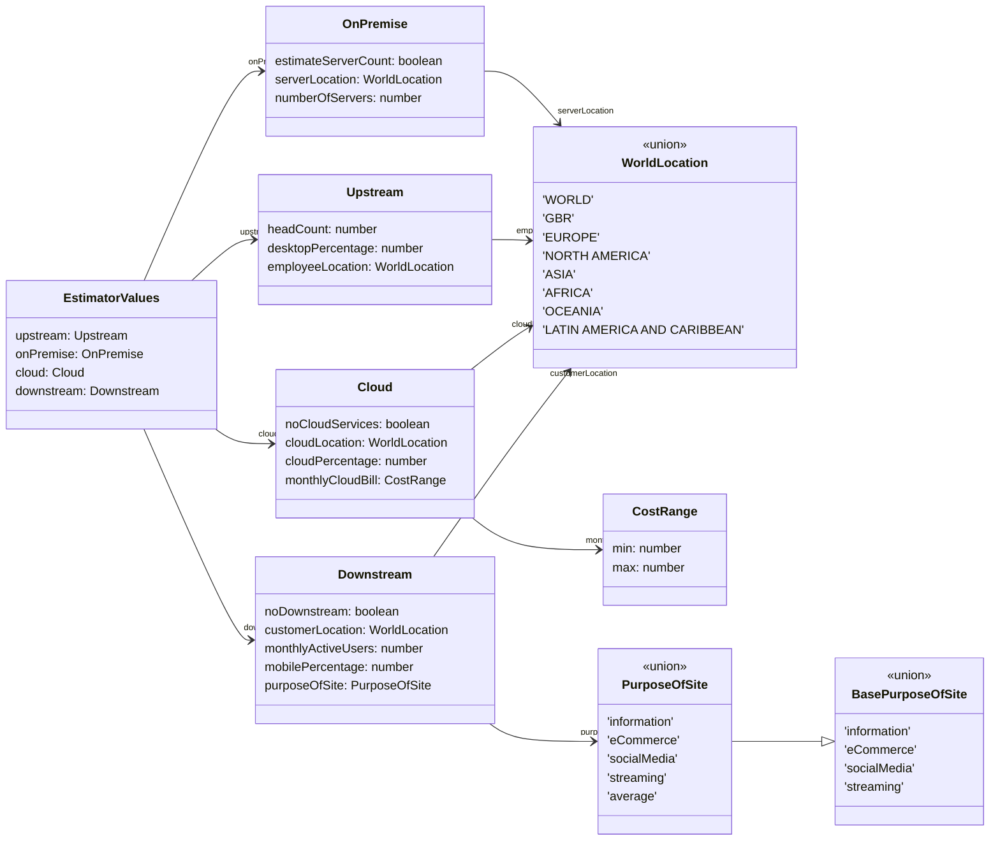
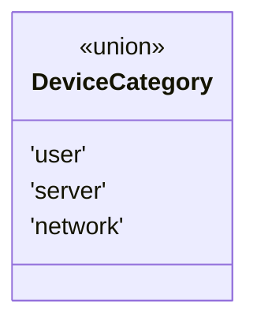
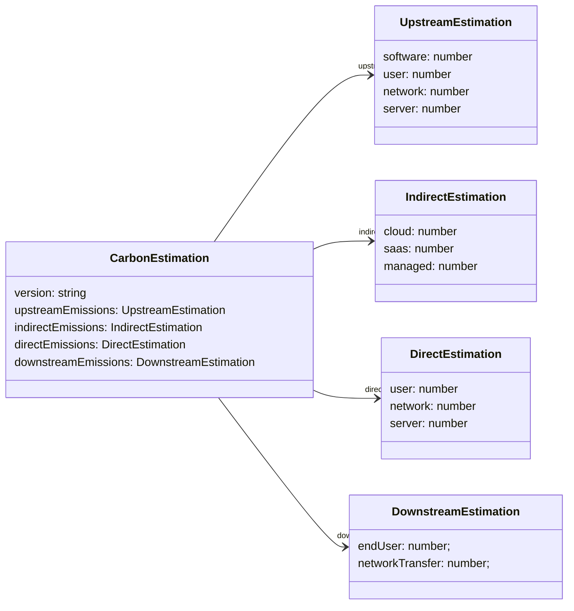
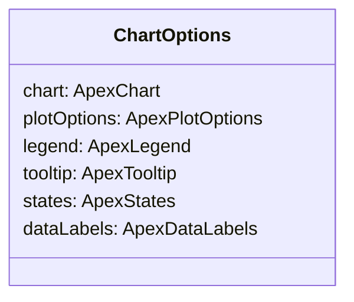

# Types

This page details other important types within the project.

## Carbon Estimator

### EstimatorValues



This is the input data that the [CarbonEstimationService](services.md#carbonestimationservice) requires.

### EstimatorFormValues

This contains the data as entered on the main form, which uses Angular FormGroup and FormControl classes. It is mostly the same as the above but it also allows for `unknown` to be selected for On-premise and Cloud locations, which will be converted to `global` before sending to the estimation service.

### DeviceCategory



This union defines the possible direct/upstream TCS categories that a device can fall under. This helps to simplify the code that calculates the total for each category in the estimation.

### CarbonEstimation



This is the type output at the end of the estimation process. As a final output the values will be in percentages that add up to 100 but the components are also reused in the process to hold real values in Kg CO2e. The version will be driven by the version of the npm package.

### ChartOptions



This contains options used to specify the layout of the visualisation chart.

## Units

We make use of multiple types that redefine the Typescript `number` type. At present this is for easy documentation of inputs and return types, it does not prevent you from calling functions with any kind of number type. There are libraries and ways to make this a compile error but it would add overhead and complicate test expectation setup so this is something that you should be aware of.

```typescript
export type Watt = number;
export type Hour = number;
export type Year = number;
export type KilowattHour = number;
export type KgCo2e = number;
export type Gb = number;
```

## Utils

### NumberObject

We define a `NumberObject` type as follows:

```typescript
export type NumberObject = { [s: string]: number };
```

Which essentially refers to any kind of object with properties that are all numeric. We export two utility functions to perform some generic actions on objects of this type.

#### sumValues()

```typescript
sumValues(input: NumberObject): number
```
Returns the total of every number in the object.

#### multiplyValues()

```typescript
multiplyValues<T extends NumberObject>(input: T, factor: number): T
```

Multiplies every number in the object by the given factor, returning the same type as the input.

These are used at the end of the estimation process to calculate totals and scale the estimations from Kg CO2e to percentages.
